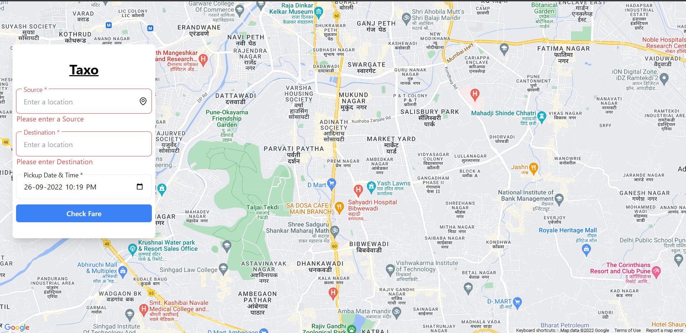
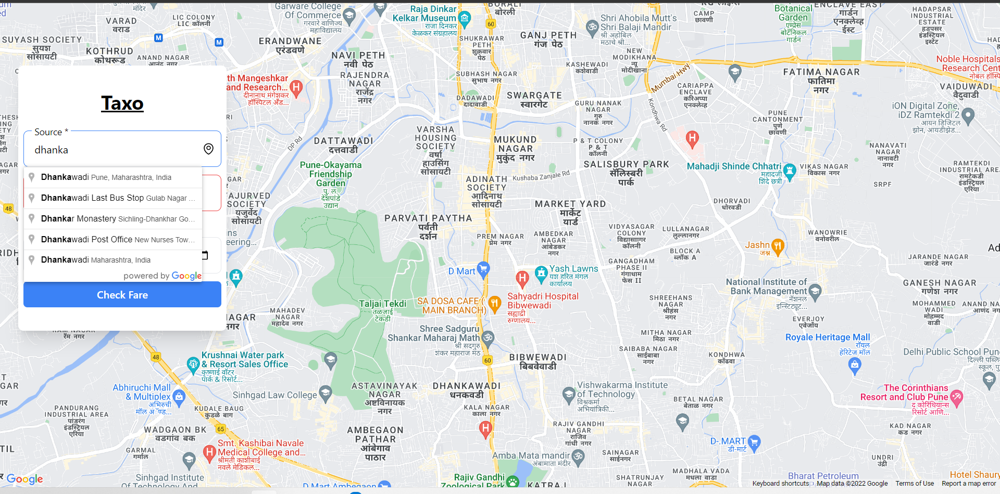
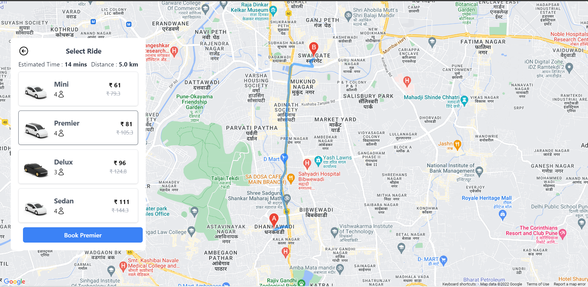

# Taxo - Cab Fare Predictor

[](https://www.youtube.com/watch?v=RuUkCNCyf14)



## Features
1. Google map that shows path (from pickup to drop location
2. Select the current location as the pickup location
3. Select desired pickup timingDistance and the estimated time of drop between two locations
4. Cab list with prices based on distance and time
5. Get the **Toll** between the two locations


### API used:

- Places API
- Maps SDK for Android
- Directions api
- Distance Matrix API
- [Tollguru](https://tollguru.com/toll-api-docs/)

add `.env` file in root directory
```
REACT_APP_MAP_API_KEY=your_google_api_key
REACT_APP_TOOL_API_KEY = your_tollguru_api_key
```

run `npm install` to install the dependencies and run the project `npm start`